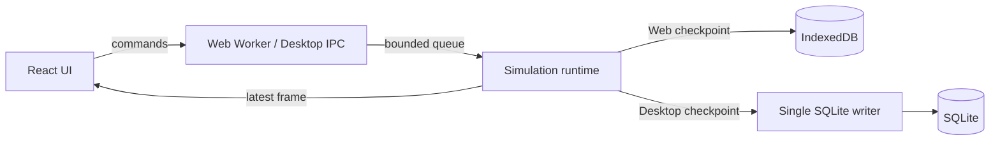
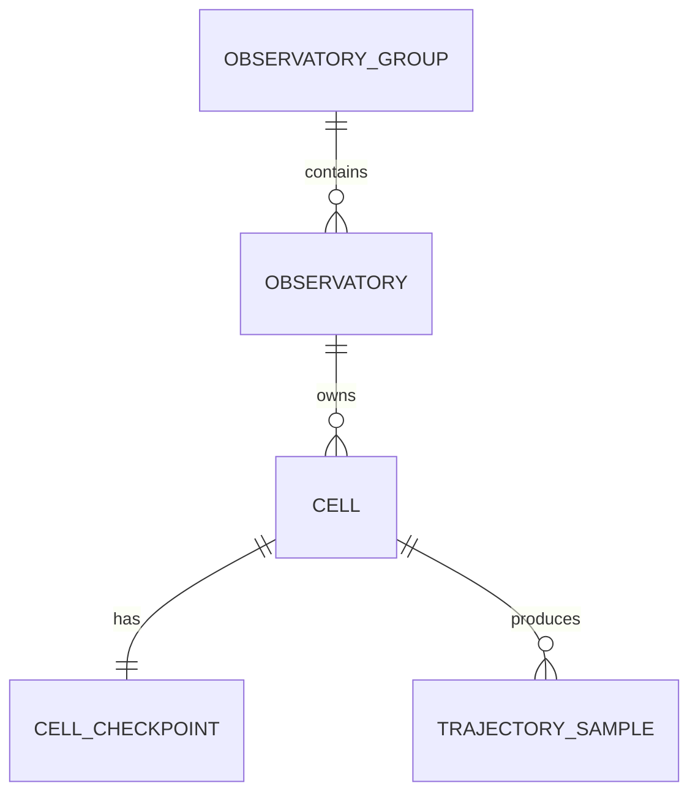

# 群体涌现模拟运行时

## 目标

让浏览器 Web Worker、Node.js 对照工具与 Rust 桌面后端产生相同语义的 Runner-Rotor 细胞轨迹。Web Worker 是 Web 版科学状态权威；React 主线程只消费科学帧并绘制可变形细胞。

## 运行边界

- 模拟采用固定时间步；每个细胞具有独立 RNG 状态，避免线程调度改变科学结果。
- 同一观察台固定分配给一个模拟 Worker，保证 tick 顺序，无跨线程共享可变细胞状态。
- Web 版不发出模拟 HTTP 请求；Worker 与 IndexedDB 不进入主线程动画帧临界路径。
- 队列达到容量时拒绝新命令；视觉帧采用 latest-only 策略，允许丢弃中间帧。
- 数据库只保存科学状态、检查点和抽样轨迹，不保存膜粒子或骨架图形状态。
- Web 版 IndexedDB 只保存检查点，不保存完整轨迹；Canvas 的可视尾迹按群体规模动态限额，群体合计最多绘制约 12000 个轨迹点。

## SQLite 关系

观察台必须属于一个组；细胞必须且只能属于一个观察台。删除观察台会级联删除其细胞数据，删除组则在仍有关联观察台时被拒绝。轨迹样本按固定 tick 抽样，并由数据库线程在单个事务中批量写入。

## 性能验收

- 活动观察台只有一个 Canvas 和一个 `requestAnimationFrame`。
- 前端不因每个细胞帧触发 React 组件更新。
- 100 个细胞时，桌面浏览器目标为渲染帧耗时 P95 小于 16.7 ms。
- 数据库写入以批次事务完成，主线程不得出现由 SQLite 导致的 50 ms 以上长任务。
- 后端过载时优先降低推送帧频，不改变固定模拟时间步，不产生倒序数据。
